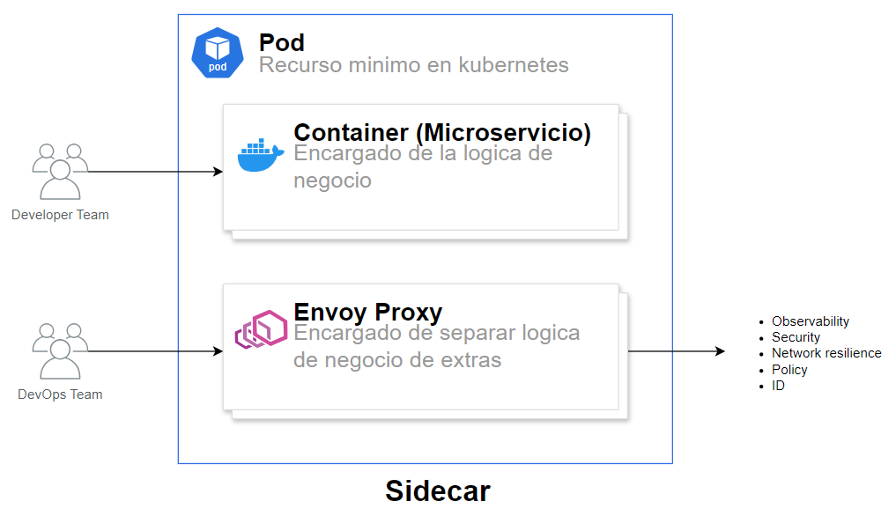
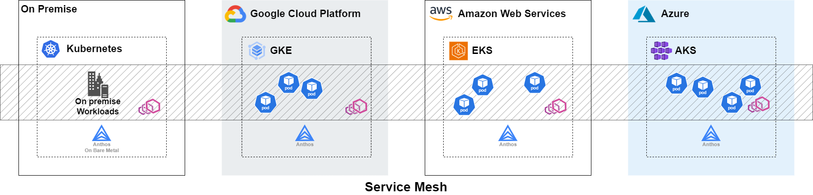
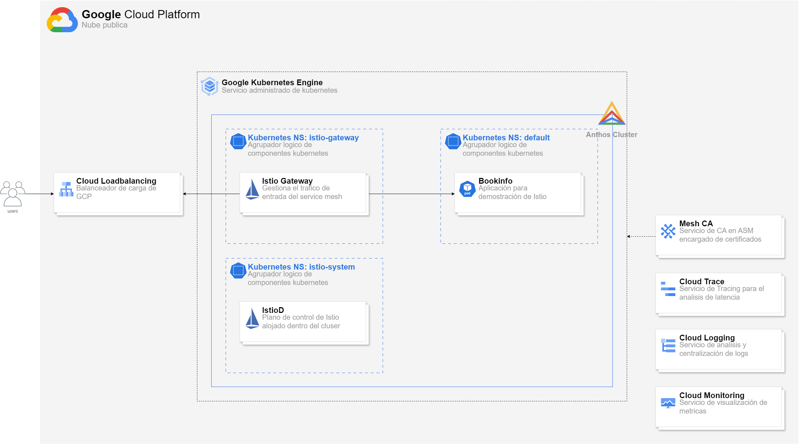
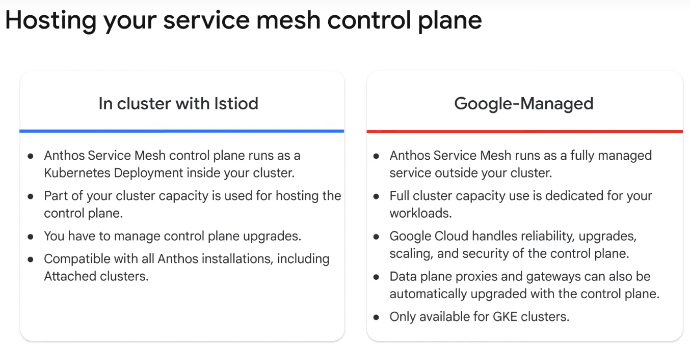
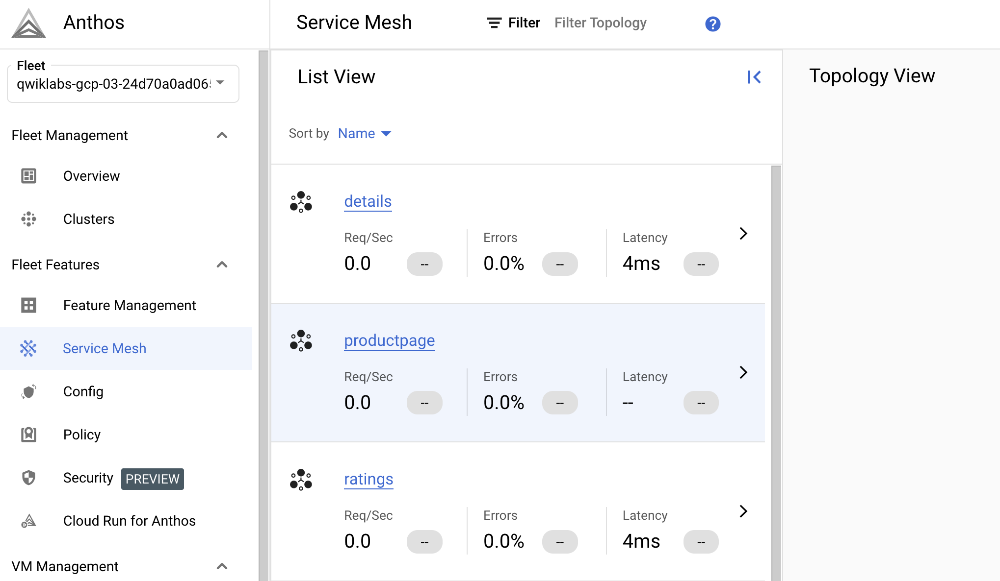
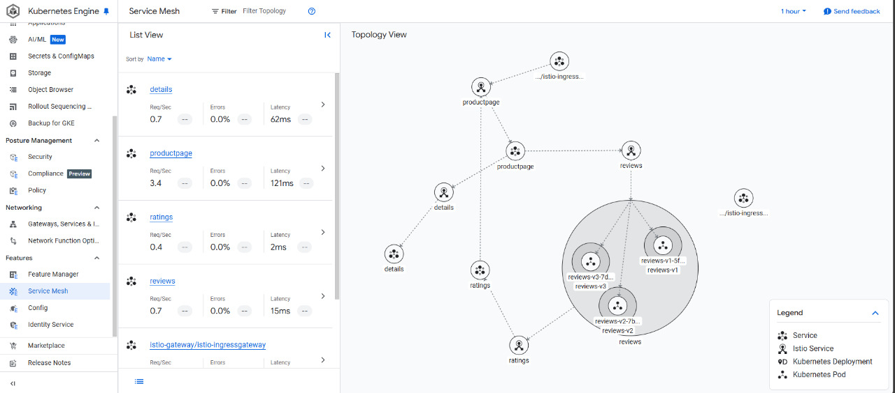

<p align="center">
  
</p>

<h1 align="center" style="margin-bottom: 0;">Primeros pasos hacia una arquitectura híbrida</h1>
<h3 align="center" style="margin-top: 5px;">con Anthos Service Mesh</h3>


### Introducción

#### **¿Qué es Anthos Service Mesh?**

Anthos Service Mesh (ASM) es la implementación administrada de Istio por Google, que permite gestionar tráfico, seguridad y observabilidad en aplicaciones desplegadas en Kubernetes.

#### Objetivos de la instalación

* Demostración de instalación de Anthos Service Mesh en un cluster de GKE
* Desplegar la aplicación [Bookinfo Application](https://istio.io/latest/docs/examples/bookinfo/), aplicación de muestra de Istio
* Demostración de componentes propios de Istio Service Mesh

#### **¿Qué problemas resuelve una Service Mesh?**

Las Service Mesh como Istio o Anthos Service Mesh resuelven varios desafíos comunes en arquitecturas de microservicios:

- **Desacoplamiento de responsabilidades**: A medida que avanzamos en arquitecturas de microservicios, notamos que todos comparten una serie de componentes en común, como **observabilidad, trazabilidad, seguridad/autorización y resiliencia ante posibles fallos de red**.  

  Anthos/Istio permite la separación de responsabilidades, asegurando que nuestros microservicios se enfoquen únicamente en la lógica de negocio, mientras que los pods dedicados a la Service Mesh manejan estos aspectos transversales.  
  Para lograr esto, Anthos e Istio utilizan el **patrón sidecar**, implementando **Envoy** como proxy en cada pod.  

<br>

<p align="center">
  
</p>


- **Gestión del trafico:** Service mesh permite un control detallado sobre el flujo dentro de nuestro cluster, esto incluye **mirroring de trafico, timeouts, retries, circuit breakers** para aumentar la resiliencia del sistema.

- **Seguridad reforzada**: Proporciona comunicación cifrada entre servicios mediante **mTLS** sin necesidad de modificar la aplicación. Además, permite establecer **políticas de autenticación y autorización** centralizadas, integrándose con sistemas de identidad como **JWT y OAuth2** para la gestión de accesos.

- **Observabilidad y monitoreo**: Service Mesh permite recolectar **métricas de tráfico y latencia** utilizando herramientas como **Prometheus, Grafana y Cloud Monitoring**. También habilita **tracing distribuido** con **Jaeger, Zipkin o Cloud Trace**, facilitando la depuración de errores y el análisis del rendimiento de cada microservicio en la arquitectura. 

- **Multi-clúster y multi-cloud**: Una Service Mesh facilita la interconexión de **varios clústeres Kubernetes**, ya sea dentro de la misma nube o en entornos híbridos on-premise/nube. Esto permite una mayor flexibilidad al reducir la dependencia de un solo proveedor y facilita la implementación de arquitecturas **de alta disponibilidad y disaster recovery** entre múltiples regiones.

<br>

<p align="center">
  
</p>

<br>

#### **Comparación: Anthos Service Mesh vs. Istio Open Source**

Para entender mejor cuándo elegir **Anthos Service Mesh (ASM)** o **Istio Open Source**, aquí tienes una tabla comparativa que destaca sus diferencias clave:

| **Característica**              | **Anthos Service Mesh (ASM)**                                                 | **Istio Open Source**                        |
|---------------------------------|-------------------------------------------------------------------------------|----------------------------------------------|
| **Administración**              | Administrado por Google Cloud.                                                | Instalación y gestión manual por el usuario. |
| **Actualizaciones**             | Se actualiza automáticamente en versiones compatibles.                        | Requiere actualizaciones manuales.         |
| **Seguridad**                   | Integrado con IAM y políticas de seguridad avanzadas.                         | Configurable manualmente con RBAC y mTLS.  |
| **Integración con GCP**         | Se integra nativamente con **Cloud Logging, Cloud Monitoring y Cloud Trace**. | Se debe configurar manualmente para integraciones con GCP. |
| **Soporte y SLA**               | Soporte oficial de Google Cloud con SLA.                                      | Comunidad Open Source sin garantía de soporte. |
| **Escalabilidad**               | Optimizado para entornos empresariales en Google Cloud.                       | Flexible, pero depende del usuario. |
| **Multi-clúster y multi-cloud** | Gestión centralizada de múltiples clústeres con **Fleet API**.                | Requiere configuración manual con Istio Multi-cluster. |
| **Costo**                       | Puede generar costos adicionales dependiendo del uso.                         | Open Source y gratuito, pero con costos operativos. |

> **Conclusión rápida:**  
> - Si tu arquitectura está basada en **Google Cloud**, **Anthos Service Mesh** simplifica la administración, seguridad y observabilidad con una integración nativa.  
> - Si buscas una solución más **flexible y auto-gestionada**, **Istio Open Source** te permite mayor control y personalización, pero requiere más esfuerzo en su administración.

<br>

### **Arquitectura Propuesta:**

<p align="center">
  
</p>

<br>

---

### **Requisitos previos**

#### **Conocimientos recomendados:**

Antes de instalar Anthos Service Mesh, es recomendable tener experiencia con:


* Conceptos en Kubernetes
* Networking en Kubernetes
* Google Cloud Platform (GCP).
* Conceptos de seguridad en microservicios (mTLS).
* Istio Service Mesh

#### **Herramientas necesarias:**

* kubectl
* asmcli
* helm/helmfile
* gcloud
* Linux CLI

**Nota:** En esta instalación utilizaremos **"Anthos In-cluster with IstioD"**, lo que significa que el **control plane** de ASM se ejecutará dentro del clúster en el namespace `istio-system` como un deployment de Kubernetes. Referencia: [Cloud Skills Boost](https://www.cloudskillsboost.google/paths/20/course_templates/435/video/427972).

<br>

<p align="center">
  
</p>


---

### **Instalación de Anthos Service Mesh**


#### **1. Preparación del entorno**

1. Ingresar a la consola de GCP.
2. Acceder a Cloud Shell.
3. Definir variables de entorno:

```bash

export PROJECT_ID=$(gcloud config get-value project)
export PROJECT_NUMBER=$(gcloud projects describe ${PROJECT_ID} --format="value(projectNumber)")

## Podemos sustituir el nombre del cluster segun nuestra necesidad
export CLUSTER_NAME=asm-cluster
## Podemos sustituir la zona del cluster segun nuestra necesidad
export CLUSTER_ZONE=us-central1-a

export WORKLOAD_POOL=${PROJECT_ID}.svc.id.goog
export MESH_ID="proj-${PROJECT_NUMBER}"
```

4. Verificar que el usuario IAM tenga el rol `roles/owner`:

```bash
## Validacion si tenemos el rol 'owner'
gcloud projects get-iam-policy $PROJECT_ID \
    --flatten="bindings[].members" \
    --filter="bindings.members:user:$(gcloud config get-value core/account 2>/dev/null)"
```

5. Crear el clúster con nodos preemptibles (para demostración):

```bash
gcloud config set compute/zone ${CLUSTER_ZONE}

## Creacion del cluster

gcloud container clusters create ${CLUSTER_NAME} \
    --machine-type=e2-medium \
    --num-nodes=5 \
    --preemptible \
    --zone=${CLUSTER_ZONE} \
    --disk-size=30GB \
    --labels mesh_id=${MESH_ID} \
    --workload-pool=${WORKLOAD_POOL} \
    --logging=SYSTEM,WORKLOAD
```

6. Obtener credenciales y asignar rol de administrador:

```bash
## Obtenemos las credenciales de nuestro cluster
gcloud container clusters get-credentials ${CLUSTER_NAME} \
     --zone $CLUSTER_ZONE \
     --project $PROJECT_ID

## Creamos el rol de administrador

## En caso utilizamos una cuenta de usuario (IAM)
kubectl create clusterrolebinding cluster-admin-binding \
    --clusterrole=cluster-admin \
    --user=$(gcloud config get-value core/account)

## En caso utilizemos una cuenta de servicio (ServiceAccount IAM)
kubectl create clusterrolebinding sa-cluster-admin-binding \
    --clusterrole=cluster-admin \
    --serviceaccount=default:$(gcloud config get-value core/account)
```

7. Crear el namespace `istio-system`:

```bash
kubectl create namespace istio-system
```

8. Validar pre-requisitos para la instalación:

```bash
## Instalación de comando 'asmcli'
curl https://storage.googleapis.com/csm-artifacts/asm/asmcli_1.20 > asmcli
chmod +x asmcli
sudo cp asmcli /usr/bin

$ asmli

asmcli 1.20.8-asm.10+config1
usage: asmcli [SUBCOMMAND] [OPTION]...

Set up, validate, and install ASM in a Google Cloud environment.
Use -h|--help with -v|--verbose to show detailed descriptions.


## Validacion pre-instalacion de istio
asmcli validate --project_id $PROJECT_ID \  
    --cluster_name $CLUSTER_NAME \  
    --cluster_location $CLUSTER_ZONE \  
    --fleet_id $PROJECT_ID \
    --output_dir ./asm_output

## Explicacion del comando anterior:
## --project_id: ID del proyecto de Google Cloud.
## --cluster_name: Nombre del cluster de Kubernetes que estamos validando.
## --cluster_location: Zona donde se encuentra el cluster de Kubernetes.
## --fleet_id: ID del proyecto usado para gestionar la flota de clusters.
## --output_dir: Carpeta donde se guardaran los archivos generados por la validacion.

## No importa si este da algun error durante la ejecucion de este comando
## No estamos instalando istio, solamente estamos creando, una serie de archivos relevantes

```


9. **Instalación de Anthos Service Mesh:**


```bash
## Instalacion de Anthos como deployment por medio de la utilidad 'asmcli'
asmcli install --project_id $PROJECT_ID \   
    --cluster_name $CLUSTER_NAME \  
    --cluster_location $CLUSTER_ZONE \  
    --fleet_id $PROJECT_ID \  
    --output_dir ./asm_output \  
    --enable_cluster_roles \   
    --enable_gcp_apis \   
    --enable_gcp_iam_roles \   
    --enable_registration \  
    --ca mesh_ca  \
    --enable_namespace_creation

## Explicacion del comando anterior:
## --project_id: ID del proyecto de Google Cloud.
## --cluster_name: Nombre del cluster de Kubernetes.
## --cluster_location: Zona donde se encuentra el cluster.
## --fleet_id: ID del proyecto para gestionar la flota de clusters.
## --output_dir: Carpeta donde se guardaran los archivos de instalacion.
## --enable_cluster_roles: Activa roles necesarios para el cluster.
## --enable_gcp_apis: Habilita las APIs necesarias de Google Cloud.
## --enable_gcp_iam_roles: Permite el uso de roles de IAM de Google Cloud.
## --enable_registration: Activa el registro del cluster en Google Cloud.
## --ca mesh_ca: Configura la autoridad de certificacion de la malla.
## --enable_namespace_creation: Permite crear namespaces automaticamente.

```
10. **Inyección de Istio en namespaces**

```bash
## Obtener la revision actual de Istio
REVISION=$(kubectl get deploy -n istio-system -l app=istiod -o \
jsonpath={.items[*].metadata.labels.'istio\.io\/rev'})

## Definir el namespace a inyectar
export NS_INYECT=ns-a-inyectar

## Etiquetar el namespace para la inyeccion de Istio
kubectl label namespace $NS_INYECT istio-injection=enabled --overwrite
kubectl label namespace $NS_INYECT istio.io/rev=$REVISION --overwrite

## Verificar las etiquetas del namespace
kubectl get namespace $NS_INYECT --show-labels
```
<br>

**Funcion que se encarga de inyectar namespaces:**


```bash
inject_istio_namespace() {
  if [ -z "$1" ]; then
    echo "Uso: inject_istio_namespace <namespace>"
    return 1
  fi

  NS_INYECT=$1

  REVISION=$(kubectl get deploy -n istio-system -l app=istiod -o \
  jsonpath={.items[*].metadata.labels.'istio\.io\/rev'})

  if [ -z "$REVISION" ]; then
    echo "Error: No se pudo obtener la revisión de Istio."
    return 1
  fi

  kubectl label namespace "$NS_INYECT" istio-injection=enabled --overwrite
  kubectl label namespace "$NS_INYECT" istio.io/rev="$REVISION" --overwrite
}

## Uso de la funcion
## inject_istio_namespace mi-namespace
```

**11. Instalación de Istio-gateway con Helmfile:**

```bash

## Creacion de namespace para istio-gateway
kubectl create istio-gateway

## Inyeccion de Istio a el namespaces
### Utilizando la funcion creada anteriormente
inject_istio_namespace istio-gateway

### Manera tradicional

## Obtener la revision actual de Istio
REVISION=$(kubectl get deploy -n istio-system -l app=istiod -o \
jsonpath={.items[*].metadata.labels.'istio\.io\/rev'})

## Definir el namespace a inyectar
export NS_INYECT=ns-a-inyectar

## Etiquetar el namespace para la inyeccion de Istio
kubectl label namespace $NS_INYECT istio-injection=enabled --overwrite
kubectl label namespace $NS_INYECT istio.io/rev=$REVISION --overwrite

## Verificar las etiquetas del namespace
kubectl get namespace $NS_INYECT --show-labels

## Instalacion de istio-gateway

cd ./manifests/istio-gateway

helmfile apply

## Se puede editar el archivo "values.yaml" a nuestra conveniencia

## Validacion post-instalacion:
kubectl get all -n istio-gateway

NAME                                 READY   STATUS    RESTARTS   AGE
pod/istio-ingress-xxxxxxxxxx-xxxxx   1/1     Running   0          167m

```

---

## **Instalación de una aplicación de demostración en Anthos Service Mesh**

Una vez instalado **Anthos Service Mesh (ASM)** en nuestro clúster, procederemos a desplegar una aplicación de prueba que nos permitirá validar su funcionamiento. Para ello, utilizaremos la aplicación [Bookinfo Application](https://istio.io/latest/docs/examples/bookinfo/), una demo oficial de Istio diseñada para demostrar la observabilidad, el control de tráfico y la seguridad dentro de una **Service Mesh**.

### **Arquitectura de la aplicación**
La aplicación **Bookinfo** está compuesta por múltiples microservicios interconectados que simulan una tienda de libros en línea. Estos servicios incluyen la gestión de productos, detalles, reseñas y calificaciones.

<br>

<p align="center">
  
</p>

<br>

### **Pasos de instalación**

**1. Anotación del Namespace**
Para que los servicios desplegados formen parte de **Anthos Service Mesh**, es necesario asegurarnos de que el namespace donde serán implementados esté anotado correctamente para la inyección automática del sidecar de Istio.

Si no lo hemos hecho antes, debemos etiquetar el namespace `default`:

```bash
kubectl label namespace default istio-injection=enabled --overwrite
```

**2. Despliegue de la aplicación**
Aplicamos los manifiestos de Kubernetes que incluyen los Deployments y Services necesarios para Bookinfo.

---

```bash
kubectl apply -f ./manifests/bookinfo/app/bookinfo.yaml

## Validamos que la aplicacion de manifiestos se haya realizado
kubectl get services

NAME          TYPE        ...
details       ClusterIP   ...
kubernetes    ClusterIP   ...
productpage   ClusterIP   ...
ratings       ClusterIP   ...
reviews       ClusterIP   ...


kubectl get pods

NAME                              READY   STATUS    RESTARTS   AGE
details-v1-79f774bdb9-6l54w       2/2     Running   0          101s
productpage-v1-6b746f74dc-4xccm   2/2     Running   0          100s
ratings-v1-b6994bb9-7g4z2         2/2     Running   0          100s
reviews-v1-545db77b95-hkh9p       2/2     Running   0          100s
reviews-v2-7bf8c9648f-cmsxj       2/2     Running   0          100s
reviews-v3-84779c7bbc-8b8qp       2/2     Running   0          100s

## Nota: notaremos que ahora nuestros pods contendran 2 contenedores '2/2' 
## esto significa que el sidecar ha sido 'inyectado' correctamente

## Para validar que asi sea. ejecutamos el siguiente comando
## kubectl describe pod/<pod-name>
## En la seccion de contenedores, veremos 2 uno con el nombre de 'istio-proxy'

```
**3. Validación de la aplicación**
Ejecutamos una prueba para verificar que la aplicación responde correctamente.

```bash
kubectl exec -it $(kubectl get pod -l app=ratings \
    -o jsonpath='{.items[0].metadata.name}') \
    -c ratings -- curl productpage:9080/productpage | grep -o "<title>.*</title>"

## Salida esperada

<title>App Simple Bookstore</title>
```

**4. Exposición de la aplicación**
Para exponer la aplicación en Kubernetes tradicional, usaríamos un Ingress, pero en una Service Mesh utilizamos un Gateway y VirtualServices.

Aplicamos los recursos necesarios:


```bash
## Aplicamos 'Gateways' y 'VirtualServices'
kubectl apply -f ./manifests/bookinfo/istio-components/bookinfo-gateway.yaml

## Obtenemos la IP de nuestro Gateway (entrypoint)

kubectl get svc -n istio-gateway

## Buscamos dentro del campo 'EXTERNAL-IP' y guardamos esa IP en una variable.

NAME                   TYPE           ...   EXTERNAL-IP  ...
istio-ingressgateway   LoadBalancer   ...   34.72.220.30 ...

## Guardamos la IP en una variable

export GATEWAY_URL=34.72.220.30

## Prueba de validacion

curl -I http://${GATEWAY_URL}/productpage
```

**Resultado:**

<br>

<p align="center">
  
</p>


**5. Generando carga constante**
Para simular usuarios accediendo a la aplicación y generar métricas en la Service Mesh, utilizamos la herramienta 'siege' para enviar solicitudes HTTP constantes.

```bash
## Descargando utilidad de trafico
sudo apt install siege -y

## Generamos trafico
siege http://${GATEWAY_URL}/productpage

```

**6. Validación de funcionamiento de Service Mesh.**
Podemos observar el tráfico en la malla de servicios desde la consola de Google Cloud, en la sección Google Kubernetes Engine > Malla de Servicios.

<br>

<p align="center">
  
</p>

<br>

**Validación de flujo de trafico e interconexión entre microservicios.**

<br>

<p align="center">
  
</p>


### Conclusión

La instalación y configuración de Anthos Service Mesh en nuestro clúster de GKE nos permite gestionar de manera eficiente el tráfico, la seguridad y la observabilidad de nuestras aplicaciones de microservicios.

Con este despliegue:

- Validamos la instalación de ASM y la inyección de sidecars en los pods.
- Exponemos la aplicación a través de un Istio Gateway en lugar de un Ingress tradicional.
- Generamos carga de tráfico para comprobar el monitoreo en Anthos.
- Visualizamos el tráfico en la malla de servicios, utilizando la interfaz de Google Cloud para analizar las conexiones entre los microservicios.

El uso de Anthos Service Mesh permite no solo simplificar la conectividad entre microservicios, sino también mejorar la seguridad, aplicar estrategias de control de tráfico y obtener visibilidad en tiempo real del comportamiento de nuestras aplicaciones.

Este flujo de trabajo nos proporciona un punto de partida sólido para explorar configuraciones avanzadas de Service Mesh, como la gestión de políticas de seguridad, circuit breakers, políticas de retry y mTLS entre servicios.

### Próximos pasos recomendados

- Implementar mTLS en la comunicación entre servicios.
- Configurar políticas de tráfico avanzadas (timeouts, retries, fault injection).
- Experimentar con configuraciones multi-clúster para mejorar la resiliencia del sistema.